# Architecture

Nuan is a no-build Chromium Manifest V3 extension. Chrome loads the files in this repository directly from `manifest.json`, so runtime architecture, source layout, and deployed architecture are the same thing.

This document is the source-level architecture reference for maintainers. It describes the durable boundaries, runtime flows, storage model, permissions, invariants, and test strategy that should remain true as the extension evolves.

## System Summary

Nuan has one authoritative runtime: the Manifest V3 background service worker in `src/background/background.js`. Extension pages and injected content scripts are clients of that worker.

The worker is responsible for:

- settings normalization and persistence
- active focused-tab tracking
- social limit enforcement
- overall domain-only browsing analytics
- alarm scheduling
- idle-state handling
- content-script injection and tab closing
- read APIs used by popup, settings, and analytics pages

The project deliberately avoids a build step, remote services, external analytics, and static all-URLs content scripts. Data remains local in `chrome.storage.local`.

## Runtime Topology

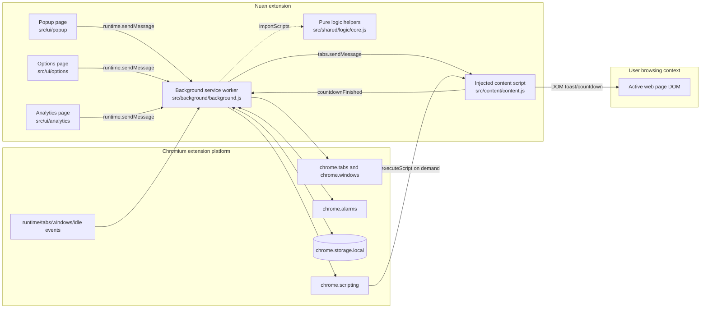

## Source Ownership

| Area | File(s) | Ownership |
| --- | --- | --- |
| Manifest | `manifest.json` | Declares MV3 worker, extension pages, permissions, host permissions, icons, and action popup. |
| Background runtime | `src/background/background.js` | Owns durable state, event listeners, storage cache, active tracking, analytics, alarms, content injection, and enforcement. |
| Pure logic | `src/shared/logic/core.js` | Domain normalization, domain matching, local date bucketing, social analytics, browsing analytics, and settings normalization. |
| Content UI | `src/content/content.js` | Injected only when needed. Renders in-page toast, blocked notice, and final countdown. |
| Popup UI | `src/ui/popup/*` | Polls `getStatus` once per second and renders current remaining or blocked time. |
| Settings UI | `src/ui/options/*` | Edits social limit domains, browsing analytics settings, excluded domains, and clear-data flow. |
| Analytics UI | `src/ui/analytics/*` | Reads social and browsing analytics from the worker and renders summaries. |
| Shared UI utility | `src/shared/dot-canvas.js` | Decorative canvas used by extension pages only. |
| Tests | `tests/unit`, `tests/e2e` | Unit coverage for pure logic and manifest assumptions; Playwright smoke coverage for unpacked extension behavior. |

## Design Principles

1. The background worker is the only authority for persisted extension state.
2. Extension pages do not read or write `chrome.storage.local` directly during normal operation.
3. Content scripts do not own business rules. They render notices and report countdown completion.
4. Time only accrues for the active tab in the focused browser window.
5. Social tracking and browsing analytics are separate state machines sharing the same active-tab context.
6. The runtime writes to storage only when normalized data actually changes.
7. Alarms exist only while there is active work to synchronize or enforce.
8. Browsing analytics store domains and timing only, not full URLs, page titles, query strings, or incognito tabs.

## Permission Model

| Permission | Used by | Purpose |
| --- | --- | --- |
| `alarms` | background worker | One-shot social enforcement alarm and active-only one-minute sync alarm. |
| `idle` | background worker | Pause overall browsing analytics while Chrome reports idle or locked. |
| `scripting` | background worker | Programmatically inject `src/content/content.js` when a tracked page needs UI. |
| `storage` | background worker | Persist settings, state, and analytics locally. |
| `tabs` | background worker and popup | Inspect active tab URL, close blocked tracked tabs, and open analytics page. |
| `<all_urls>` host permission | background worker | Match active tab domains locally and inject content UI into tracked pages when required. |

`manifest.json` does not register `content_scripts`. This is intentional: normal pages should not receive Nuan DOM elements unless the background worker has decided the page is relevant to social tracking or blocked enforcement.

## Extension Boundaries

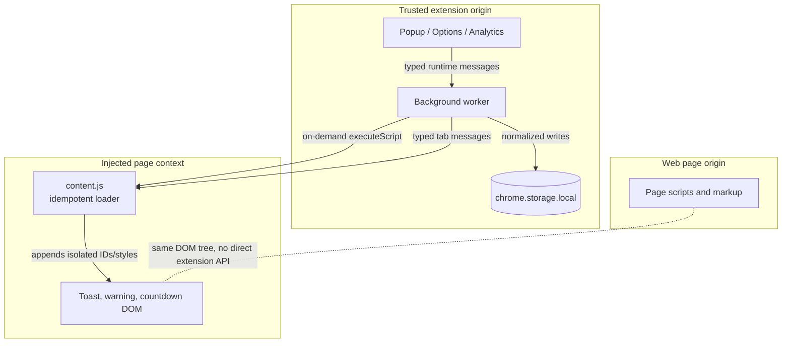

The content script runs in Chrome's isolated extension world. It can manipulate the page DOM, but page JavaScript cannot call `chrome.runtime` through it directly.

## Message Catalog

### Extension Page to Background

| Message type | Sender | Handler | Response |
| --- | --- | --- | --- |
| `getStatus` | popup | `getStatus()` | Current limit, remaining time, blocked state, reset time, active state, and current host. |
| `getSettings` | options, tests | `getSettings()` | Normalized social limit settings. |
| `getSettingsLock` | options, tests | `getSettingsLock()` | Whether a social settings change is allowed, the next unlock time, and monthly change usage. |
| `getBrowsingSettings` | options, tests | `getBrowsingSettings()` | Normalized browsing analytics settings. |
| `getAnalytics` | analytics page | `getAnalytics()` | Social daily totals, no-use streak, and most-used domains. |
| `getBrowsingAnalytics` | analytics page | `getBrowsingAnalytics()` | Browsing today/week/average, top domains, recent days, hourly activity, and recent sessions. |
| `saveSettings` | options | `saveSettings(settings)` | Validates and persists social limit and domains, enforcing the weekly/monthly change lock. |
| `saveBrowsingAnalyticsSettings` | options | `saveBrowsingAnalyticsSettings(settings)` | Syncs current browsing usage, persists analytics settings, and refreshes context. |
| `clearBrowsingAnalytics` | options | `clearBrowsingAnalytics()` | Resets browsing state and browsing analytics. |

### Background to Content

| Message type | Sender | Receiver | Purpose |
| --- | --- | --- | --- |
| `trackingStarted` | background | content | Show tracking-started toast and schedule warning/final countdown in the page. |
| `trackingPaused` | background | content | Clear scheduled warning/countdown UI for the previous tracked tab. |
| `showBlockedCloseToast` | background | content | Tell a blocked tracked page when it can be used again before the tab closes. |

### Content to Background

| Message type | Sender | Handler | Purpose |
| --- | --- | --- | --- |
| `countdownFinished` | content | `handleCountdownFinished(sender)` | Cap social usage at the configured limit, close tracked tabs, and update alarms. |

`content.js` also supports `showOneMinuteWarning` and `startClosingCountdown` as direct message types, but the current background path primarily uses `trackingStarted` and lets the content script schedule those UI transitions locally.

## Startup and Hydration

The service worker can be started by install, browser startup, extension-page messages, alarms, tab events, or storage events. Durable state is always recovered from `chrome.storage.local`.

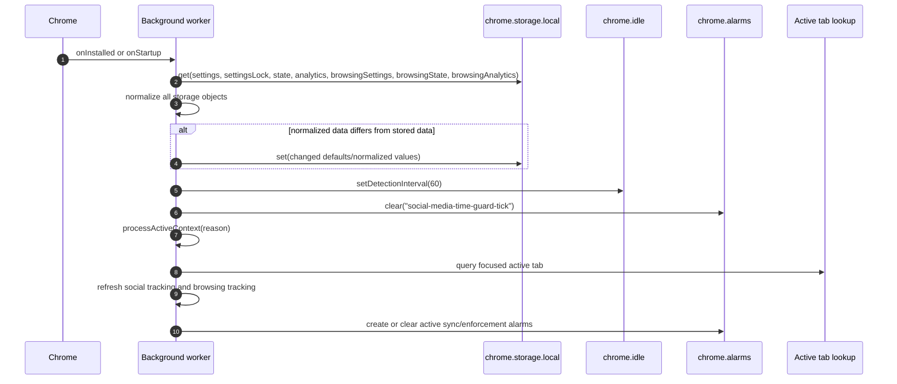

### Hydration Rules

- `runtimeCache` mirrors the seven storage keys after first hydration.
- `hydratePromise` prevents duplicate parallel storage reads during cold start.
- `chrome.storage.onChanged` updates the cache when local storage changes.
- `setStorageIfChanged()` deep-compares normalized values and skips unchanged writes.
- Storage remains the source of durability across service worker shutdowns.

## Event Coalescing

Tab activation, tab updates, tab removal, window focus changes, idle changes, settings saves, and active alarms all converge through `scheduleProcessActiveContext()`.

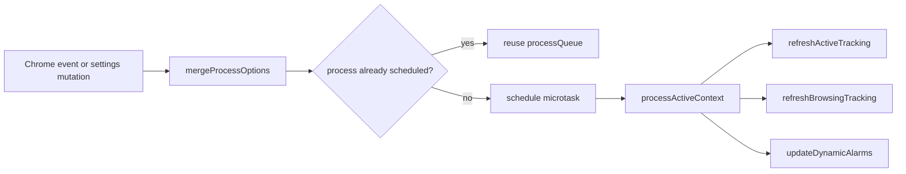

This keeps bursts of browser events from causing repeated full storage/tab/alarm work while preserving important options such as `removedTabId` and `idleState`.

## Active Social Tracking

Social tracking answers one question: "How much time has the user spent on configured social domains within the current six-hour reset window?"

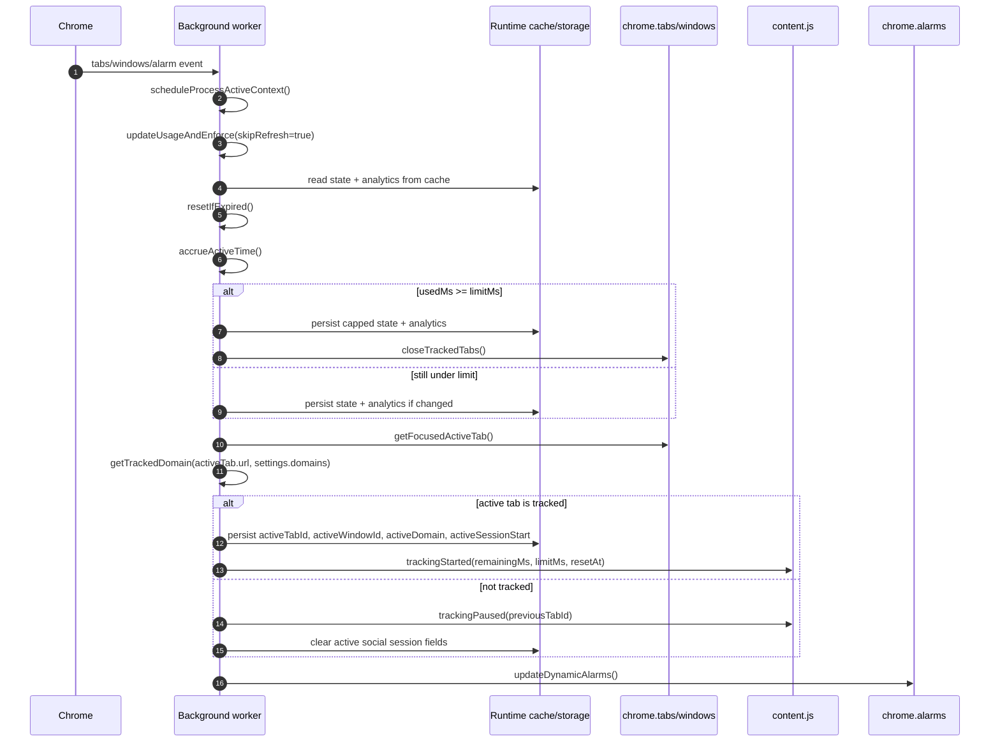

### Social State Machine

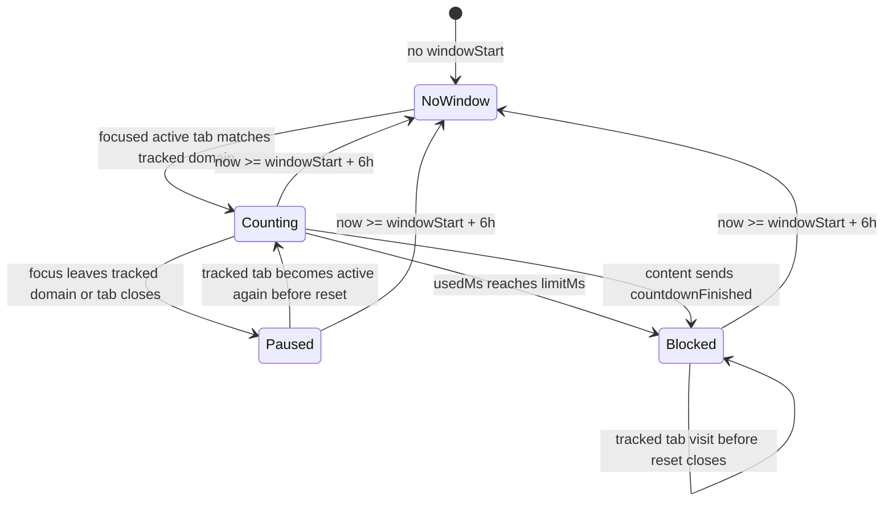

The content countdown improves user experience, but enforcement does not rely only on page timers. `SOCIAL_ENFORCE_ALARM` is scheduled to fire when the current active social session should reach the limit.

## On-Demand Content Injection and Enforcement

The manifest avoids static `content_scripts`. Instead, the background worker first tries to message an existing content script and injects `src/content/content.js` only if the tracked tab has no receiver.

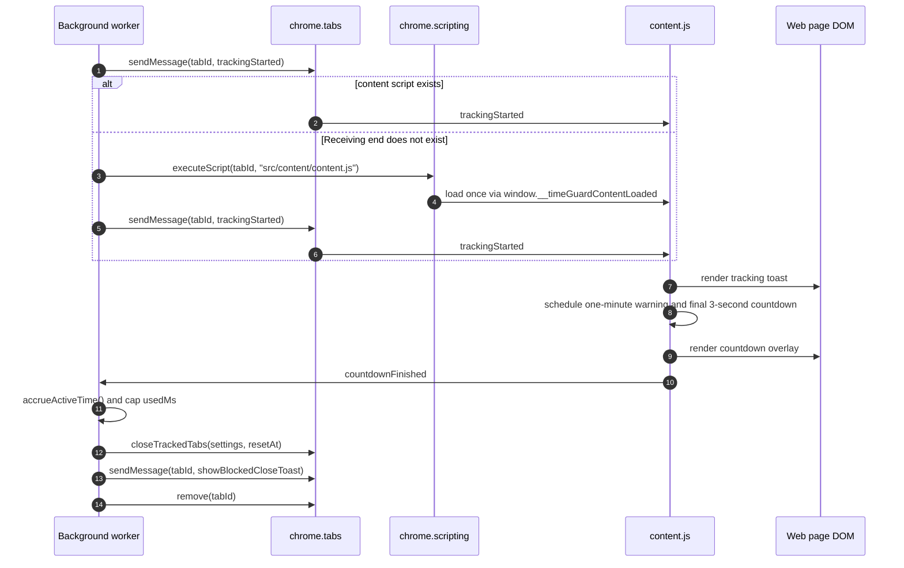

If content injection or messaging fails, `safeCloseTabWithBlockedNotice()` still closes the tab. The blocked toast is opportunistic, not required for enforcement.

## Overall Browsing Analytics

Browsing analytics track active focused web browsing by domain. This is separate from social limit enforcement.

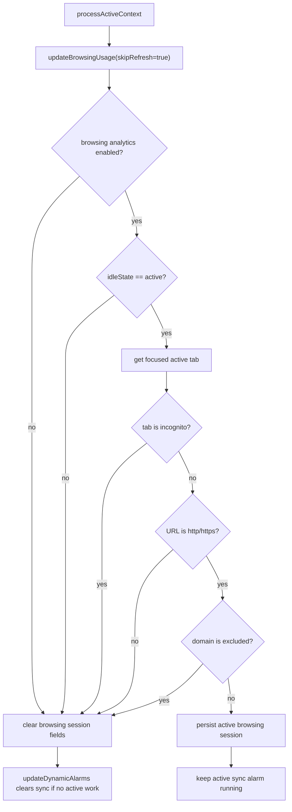

Analytics are accrued into local-day and local-hour buckets. Recent sessions are capped at `500`.

## Settings Save Flow

The settings page sends two independent save requests from one form submit: social limit settings and browsing analytics settings.

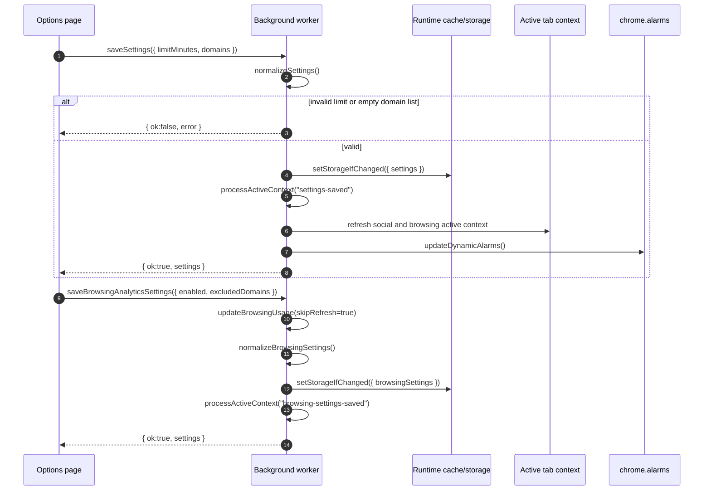

The browsing settings save syncs any currently active browsing session before changing enabled/excluded-domain policy.

## Analytics Read Flow

Analytics pages request derived read models from the background worker. The worker synchronizes active time before returning analytics so the UI does not depend on a recent alarm tick.

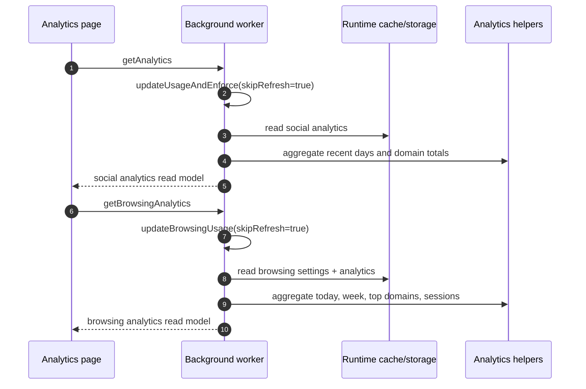

The popup uses a smaller read path: it calls `getStatus` every second, which synchronizes social usage and returns only timer/status information.

## Dynamic Alarm Model

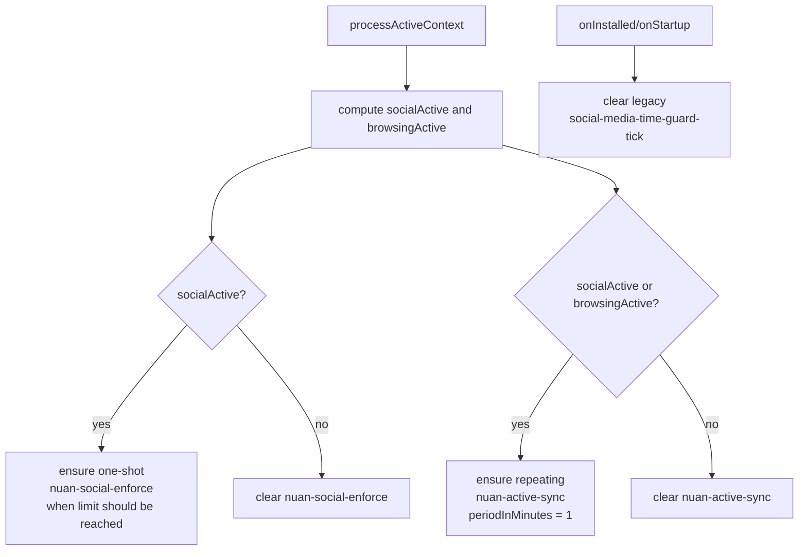

Alarm names:

- `nuan-active-sync`: repeating one-minute synchronization while social tracking or browsing analytics are active.
- `nuan-social-enforce`: one-shot enforcement alarm scheduled for the moment the active social session should exhaust remaining time.
- `social-media-time-guard-tick`: legacy repeating alarm cleared on install/startup.

## Storage Schema

All durable state lives in `chrome.storage.local` under seven top-level keys.

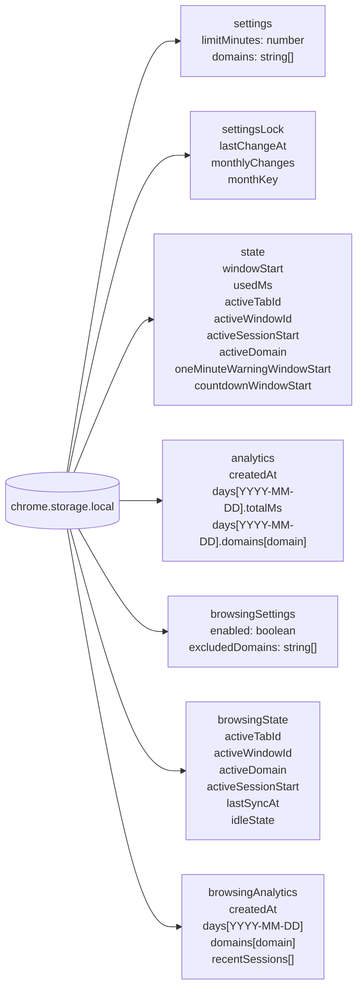

`oneMinuteWarningWindowStart` and `countdownWindowStart` are present in `DEFAULT_STATE` for compatibility with earlier state shape. Current warning/countdown scheduling is handled inside `content.js` after `trackingStarted`.

### Storage Normalization

| Key | Normalizer | Notes |
| --- | --- | --- |
| `settings` | `normalizeSettings()` | Enforces positive limit and normalized unique domains. |
| `settingsLock` | `normalizeSettingsLock()` | Clamps monthly count, stamps month key, and timestamps last change. |
| `state` | spread over `DEFAULT_STATE` | Preserves known fields and fills missing fields. |
| `analytics` | `normalizeAnalytics()` | Keeps valid local-date keys and positive domain totals. |
| `browsingSettings` | `normalizeBrowsingSettings()` | Defaults enabled to true and normalizes excluded domains. |
| `browsingState` | spread over `createDefaultBrowsingState()` | Defaults idle state to `active`. |
| `browsingAnalytics` | `normalizeBrowsingAnalytics()` | Validates days, domain stats, and recent sessions; caps recent sessions. |

## Analytics Data Shapes

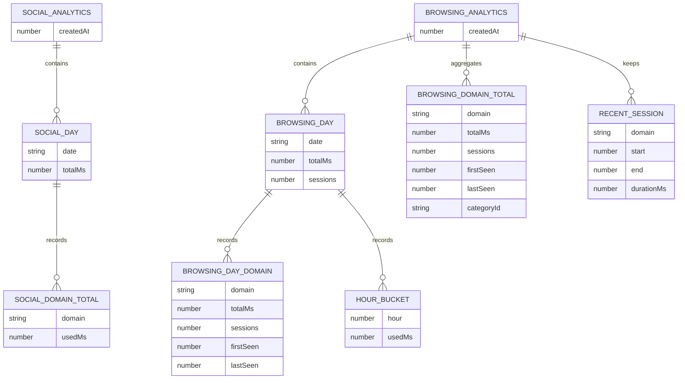

Social analytics are sliced at local day boundaries. Browsing analytics are sliced at local day and local hour boundaries.

## Domain Matching Rules

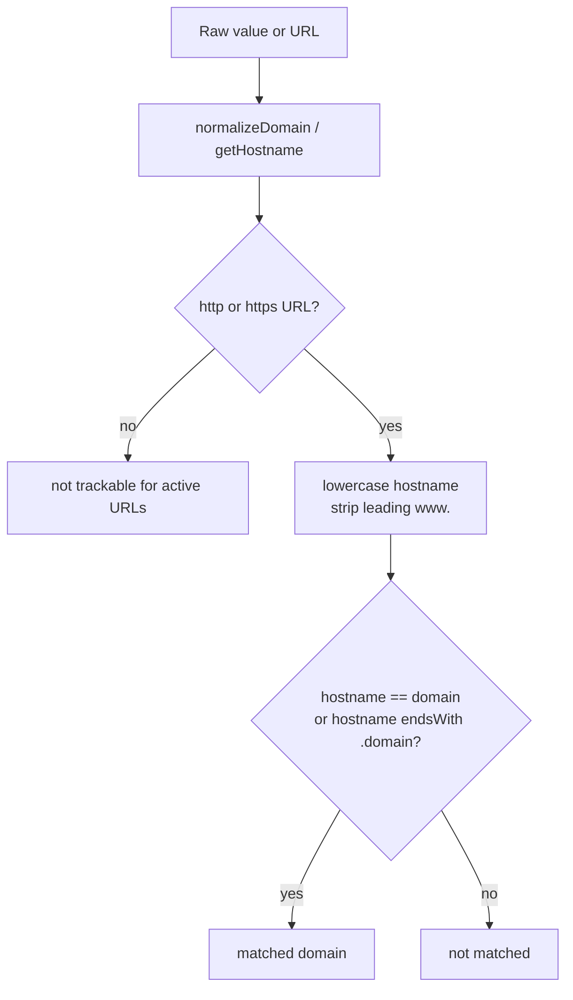

Important consequences:

- `reddit.com` matches `reddit.com` and `old.reddit.com`.
- `notreddit.com` does not match `reddit.com`.
- `chrome://`, `file://`, and other non-web schemes do not count.
- Browsing analytics reject incognito tabs before domain matching.

## Failure Handling

| Failure | Handling |
| --- | --- |
| Background API handler throws | `respondAsync()` returns `{ ok:false, error }` to sender. |
| Content receiver missing | `safeSendTabMessage()` injects `src/content/content.js` and retries once. |
| Content injection fails | Message returns `null`; enforcement can still remove the tab. |
| Tab already gone | `safeCloseTab()` ignores the error. |
| Focused active tab lookup fails | Worker falls back from `tabs.query` to `windows.getLastFocused({ populate:true })`; otherwise tracking pauses. |
| Storage unchanged | `setStorageIfChanged()` skips the write. |
| Cold service worker | First access hydrates `runtimeCache` from storage. |
| Burst of tab/window events | `scheduleProcessActiveContext()` coalesces them through `processQueue`. |

## Privacy and Security Properties

Nuan is local-first:

- No network permissions beyond host access required by Chrome for active tab inspection and script injection.
- No remote services.
- No external telemetry.
- Browsing analytics store domains only.
- Full URLs, URL paths, query strings, titles, and page content are not persisted.
- Incognito tabs are not included in browsing analytics.
- Private account, banking, payments, and health domains are excluded from browsing analytics by default.
- Content UI is injected on demand instead of running on every page.

Security-sensitive maintenance rules:

- Keep all persistence writes centralized in the background worker.
- Keep `content.js` presentation-only; do not move policy decisions into the page context.
- Treat all messages from content scripts as untrusted and validate sender context, as `handleCountdownFinished()` does by checking the sender URL against tracked domains.
- Keep manifest permission changes covered by `tests/unit/manifest.test.js`.

## Test Architecture

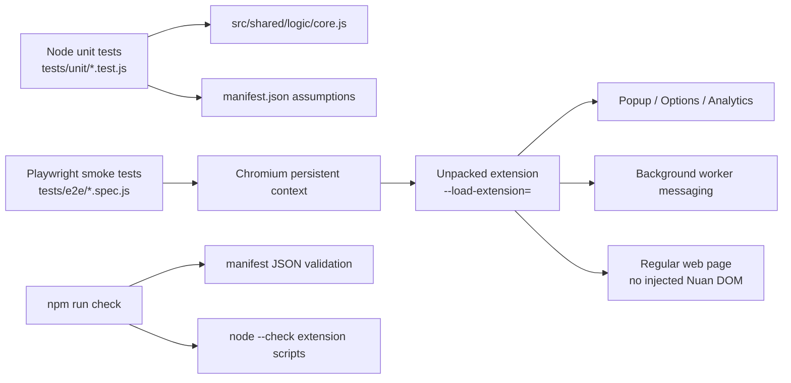

Current automated coverage verifies:

- manifest has no static content scripts
- manifest permissions stay aligned with optimized runtime behavior
- domain normalization and matching
- social analytics day bucketing and zero-duration no-op behavior
- browsing analytics day/hour/session bucketing and zero-duration no-op behavior
- popup, settings, and analytics pages load
- background messaging works from extension pages
- settings save and clear browsing data flows work
- clean analytics storage renders empty states
- regular webpages do not receive Nuan content script elements

## Operational Invariants

These are the main architecture-level rules tests and reviews should protect:

- `manifest.content_scripts` remains absent unless there is a deliberate privacy/performance reason to change it.
- `src/background/background.js` remains the only normal writer to `chrome.storage.local`.
- `runtimeCache` is always normalized before callers read from it.
- Social `usedMs` never exceeds `limitMinutes * 60 * 1000` after enforcement.
- Active social time accrues only between `activeSessionStart` and the synchronization time.
- Active browsing time accrues only when browsing analytics are enabled and `idleState` is `active`.
- A social reset window begins at first tracked social activity and lasts `6 * 60 * 60 * 1000` ms.
- Domain matching uses exact host or subdomain matching, not substring matching.
- Analytics ignore zero-duration intervals.
- Recent browsing sessions stay capped at `MAX_RECENT_BROWSING_SESSIONS`.
- `nuan-active-sync` is cleared when neither social tracking nor browsing tracking is active.
- `nuan-social-enforce` is cleared when no active social session requires enforcement.

## Architecture Tradeoffs

| Decision | Benefit | Cost |
| --- | --- | --- |
| No build step | Simple extension loading and transparent source paths. | No bundling, type checking, module splitting, or compile-time dead-code elimination. |
| Background worker as single authority | Clear state ownership and fewer race-prone storage writes. | All extension pages depend on runtime messaging. |
| On-demand content injection | Regular pages stay untouched and startup overhead is lower. | First message may need an inject-and-retry path. |
| Local `chrome.storage.local` cache | Fewer storage reads and easier normalized access. | Cache must be updated from `storage.onChanged` and rehydrated after worker restart. |
| Active-only alarms | Less idle work and lower background churn. | Correctness depends on scheduling alarms after every context refresh. |
| Content-owned countdown UI | Smooth page-local warning/countdown timing. | Background still needs alarm enforcement as the authoritative fallback. |
| `<all_urls>` host permission | Enables local domain matching and injection for user-configured domains. | Requires careful documentation and Chrome Web Store justification. |

## Change Guide

Use this checklist when changing core behavior:

1. If a storage shape changes, update the schema section and add normalization coverage.
2. If a message type changes, update the message catalog and relevant sequence diagrams.
3. If a permission changes, update the permission model, publishing documentation, and manifest tests.
4. If active tracking changes, review both social tracking and browsing analytics because they share active-tab context.
5. If content injection changes, keep the regular-page e2e test meaningful.
6. If alarm behavior changes, verify both no-active-work clearing and active-work scheduling paths.
7. If analytics aggregation changes, add unit coverage in `tests/unit/logic.test.js`.
